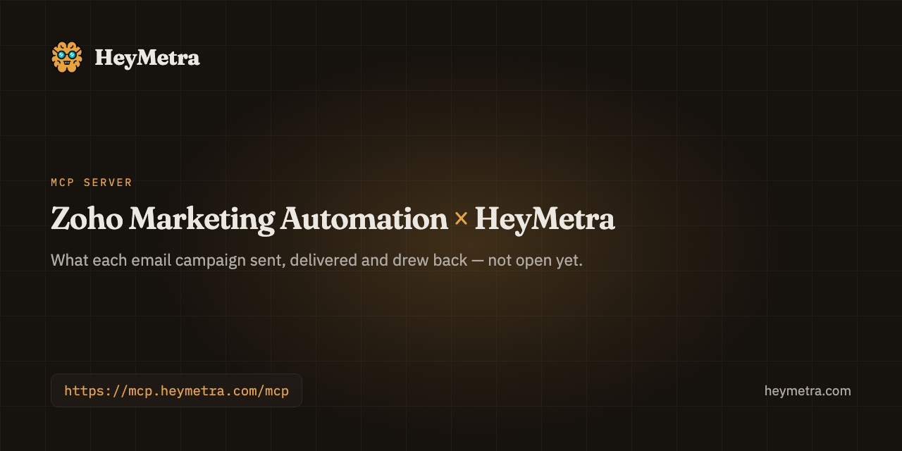

<div align="center">



# Zoho Marketing Automation &times; HeyMetra

**What each email campaign sent, delivered and drew back.**

Your pipeline lives in Zoho Marketing Automation. What it cost to fill it lives somewhere else entirely. Ask once, across both.

[](https://registry.modelcontextprotocol.io/v0/servers/com.heymetra%2Fheymetra/versions)
[](https://modelcontextprotocol.io/)
[](https://heymetra.com/security/)
[](https://heymetra.com/connectors/zoho-marketing-automation/)

```
https://mcp.heymetra.com/mcp
```

</div>

---

## Ask it things like

> Which campaigns have we sent recently?

> How many people opened and clicked the September newsletter?

> How many people unsubscribed from our last send?

No dashboard, no export, no query language. You ask in the assistant you already use and the answer comes back with the account it came from.

## Connect Zoho Marketing Automation

**1. Connect it separately from Zoho CRM and SalesIQ**

Choose Zoho Marketing Automation on the Connections screen. One Zoho sign-in covers several products, but each grant is its own.

> Marketing Automation is not Zoho Campaigns. They are different products with different campaign lists, and a Campaigns account will sign in happily and report nothing.

**2. Sign in as somebody who can see the campaigns**

On Zoho's own screen. Your password never reaches HeyMetra.

**3. Grant the one read permission**

Campaign READ. If you chose to allow changes, Zoho also lists campaign CREATE and UPDATE, which is what lets your assistant propose a campaign, an edit or a send. A read-only connection can do none of those, and nothing here reads the subscribers themselves.

**4. Add HeyMetra to the assistant you use**

Claude, ChatGPT, Cursor or Codex. The campaign tools appear there: which campaigns went out, and what each one did.

> Ask for the list of recent campaigns first, then about the one you want. A campaign cannot be looked up by its subject line.

## Then add HeyMetra to your assistant

Add HeyMetra once and it is there in every conversation. The address is the same everywhere:

```
https://mcp.heymetra.com/mcp
```

### One command

```bash
npx add-mcp https://mcp.heymetra.com/mcp
```

[`add-mcp`](https://www.npmjs.com/package/add-mcp) is a third-party installer that writes the configuration for Claude Code, Codex, Cursor, Antigravity, VS Code and seventeen other agents. It infers the name from the address, so the server lands as `heymetra`. Run against this endpoint before it was written here.

### Or by hand

<details>
<summary><b>Claude</b> — Settings → Customize → Connectors → Add custom connector</summary>

Paste the address above into Settings → Customize → Connectors → Add custom connector.

_On Team and Enterprise plans only an owner can add it, under Organization settings._

Full walkthrough: [heymetra.com/mcp/claude/](https://heymetra.com/mcp/claude/)
</details>

<details>
<summary><b>ChatGPT</b> — Settings → Security and login → Developer mode, then chatgpt.com/plugins</summary>

Paste the address above into Settings → Security and login → Developer mode, then chatgpt.com/plugins.

_The address has to end in /mcp here._

Full walkthrough: [heymetra.com/mcp/chatgpt/](https://heymetra.com/mcp/chatgpt/)
</details>

<details>
<summary><b>Grok</b> — grok.com/connectors → New Connector → Custom</summary>

Paste the address above into grok.com/connectors → New Connector → Custom.

_XAI calls this “bring your own MCP”._

Full walkthrough: [heymetra.com/mcp/grok/](https://heymetra.com/mcp/grok/)
</details>

<details>
<summary><b>Perplexity</b> — Settings → Connectors → Custom connector → Remote</summary>

Paste the address above into Settings → Connectors → Custom connector → Remote.

_Perplexity documents it as a Pro, Max and Enterprise feature._

Full walkthrough: [heymetra.com/mcp/perplexity/](https://heymetra.com/mcp/perplexity/)
</details>

<details>
<summary><b>Claude Code</b> — claude mcp add --transport http</summary>

```bash
claude mcp add --transport http heymetra https://mcp.heymetra.com/mcp
```

_Or a .mcp.json in the project root; /mcp inside a session shows what connected._

Full walkthrough: [heymetra.com/mcp/claude-code/](https://heymetra.com/mcp/claude-code/)
</details>

<details>
<summary><b>Codex</b> — ~/.codex/config.toml</summary>

```toml
[mcp_servers.heymetra]
url = "https://mcp.heymetra.com/mcp"
```

_Under an [mcp_servers.<name>] section, then codex mcp login._

Full walkthrough: [heymetra.com/mcp/codex/](https://heymetra.com/mcp/codex/)
</details>

<details>
<summary><b>Cursor</b> — ~/.cursor/mcp.json, or .cursor/mcp.json in a project</summary>

```json
{
  "mcpServers": {
    "heymetra": { "url": "https://mcp.heymetra.com/mcp" }
  }
}
```

_Leave the static OAuth fields empty; HeyMetra does not need them._

Full walkthrough: [heymetra.com/mcp/cursor/](https://heymetra.com/mcp/cursor/)
</details>

<details>
<summary><b>Antigravity</b> — ~/.gemini/config/mcp_config.json, or .agents/mcp_config.json in a project</summary>

```json
{
  "mcpServers": {
    "heymetra": { "serverUrl": "https://mcp.heymetra.com/mcp" }
  }
}
```

_The key is serverUrl, not url, unlike every other JSON client._

Full walkthrough: [heymetra.com/mcp/antigravity/](https://heymetra.com/mcp/antigravity/)
</details>

## What it may and may not touch

Propose a change to this account. Nothing is sent until you approve it, and HeyMetra cannot undo it afterwards.

Permissions are switched on per connection, and one you leave off is a tool your assistant never sees.

| Permission | What it covers | Changes anything? |
|---|---|---|
| **Full account access** | Lets your assistant read anything in this account to answer your questions. The figures are the provider's own, not ones HeyMetra has checked. It can also propose changes: none is applied until you approve it, and HeyMetra cannot undo one afterwards. | Yes — every change waits for your approval |

<details>
<summary>What each permission lets an assistant do, in full</summary>

- Ask anything about this account and get the answer from its live data. Reads only, and the figures are the provider's own rather than ones HeyMetra has checked.
- Propose a change to this account. Nothing is sent until you approve it, and HeyMetra cannot undo it afterwards.
</details>

Anything that would change something comes back as a proposal you approve, inside bounds that live in code rather than in a prompt: ±50% on a budget, 5 campaigns per action and 20 changes a rolling day, and an approval that expires after 30 minutes. [How that works](https://heymetra.com/security/).

## When something goes wrong

<details>
<summary>It connects and reports no campaigns at all.</summary>

**Why:** Usually a Zoho Campaigns account rather than a Marketing Automation one. The sign-in succeeds because it is the same Zoho account; the campaigns live in the other product.

**Fix:** Check the product name in Zoho's own menu. If it says Campaigns, this connector cannot read it and HeyMetra has no connector that can yet. Ask your assistant to send us a request for it, so it is counted.

</details>

<details>
<summary>Recent campaigns are missing from the list.</summary>

**Why:** The list comes back newest first, one page at a time, and asking for one status narrows it further. A draft is not a sent campaign.

**Fix:** Ask without naming a status, and ask for the next page if there is more than one.

</details>

## What HeyMetra reads from Zoho Marketing Automation

This is a third Zoho sign-in, separate from the CRM and from SalesIQ. Ask your assistant about campaign results: your recent campaigns, and what a single campaign did, with emails sent and delivered, opens, unique clicks, bounces, unsubscribes and spam complaints. A figure Zoho did not state comes back as unknown rather than as zero. Nothing here reads who is on a mailing list. When you connect, you choose whether your assistant may only read, or also propose changes to campaigns that wait for your approval.

<details>
<summary>About Zoho Marketing Automation</summary>

Zoho Marketing Automation is the email marketing side of Zoho: the lists, the campaigns and what each send did.
</details>

## One connection, not seven

The reason to read Zoho Marketing Automation through HeyMetra rather than through a server that only knows Zoho Marketing Automation is everything else it can answer in the same breath:

**Ads** — [Google Ads](https://heymetra.com/connectors/google-ads/) · [Meta](https://heymetra.com/connectors/meta-ads/)

**Analytics** — [Google Analytics 4](https://heymetra.com/connectors/google-analytics-4/) · [Google Search Console](https://github.com/zeisoft/google-search-console-mcp) · [PostHog](https://github.com/zeisoft/posthog-mcp)

**Ecommerce** — [Shopify](https://heymetra.com/connectors/shopify/) · [Trendyol](https://github.com/zeisoft/trendyol-mcp) · [WooCommerce](https://github.com/zeisoft/woocommerce-mcp)

**Revenue & CRM** — [Stripe](https://heymetra.com/connectors/stripe/) · [HubSpot](https://heymetra.com/connectors/hubspot/) · [Zoho CRM](https://github.com/zeisoft/zoho-crm-mcp) · [Zoho SalesIQ](https://github.com/zeisoft/zoho-salesiq-mcp) · **Zoho Marketing Automation**

**Mobile** — [AppsFlyer](https://github.com/zeisoft/appsflyer-mcp) · [RevenueCat](https://heymetra.com/connectors/revenuecat/) · [Adapty](https://github.com/zeisoft/adapty-mcp) · [App Store Connect](https://github.com/zeisoft/app-store-connect-mcp)

**Work** — [Google Calendar](https://heymetra.com/connectors/google-calendar/) · [Google Meet](https://heymetra.com/connectors/google-meet/) · [Jira](https://github.com/zeisoft/jira-mcp)

**Channels** — [Slack](https://github.com/zeisoft/slack-mcp) · [Telegram](https://github.com/zeisoft/telegram-mcp)

The full catalogue is at [heymetra.com/connectors/](https://heymetra.com/connectors/).

## Links

- [Zoho Marketing Automation connector page](https://heymetra.com/connectors/zoho-marketing-automation/)
- [HeyMetra](https://heymetra.com/) — what the product is
- [Setup for every assistant](https://heymetra.com/mcp/)
- [Security and limits](https://heymetra.com/security/)
- [Pricing](https://heymetra.com/pricing/)
- [HeyMetra's own repository](https://github.com/zeisoft/heymetra-mcp)

---

<sub>Built by <a href="https://zeisoft.com">Zeisoft</a>, who make HeyMetra. Not affiliated with Zoho Marketing Automation. This README is generated from HeyMetra's live connector catalogue and refreshed daily; corrections are welcome as issues.</sub>
